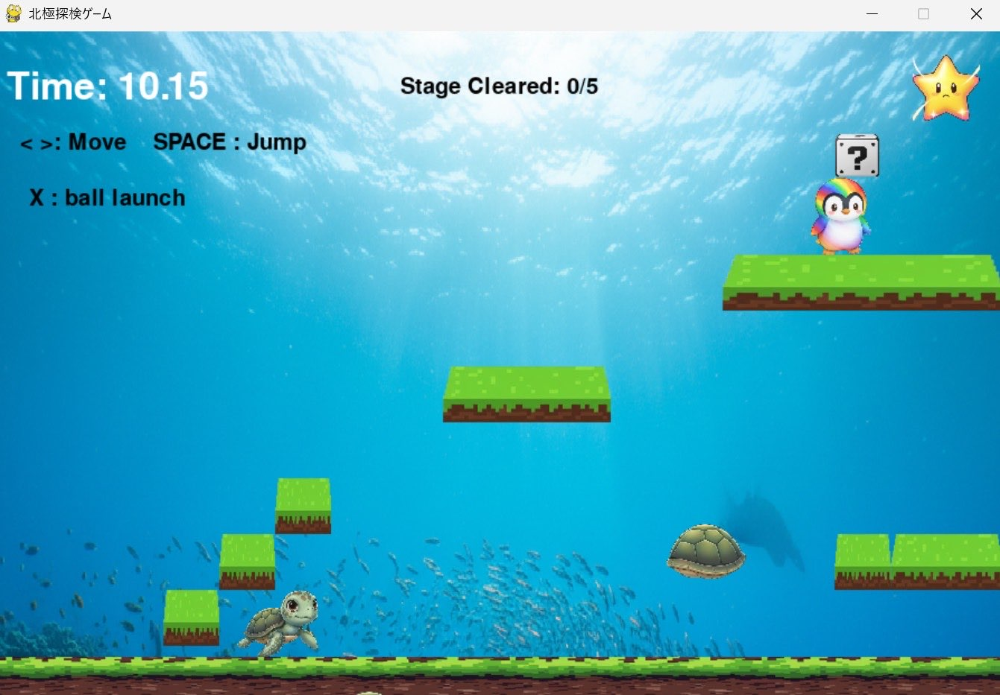

# 北極探検ゲーム

## 実行環境の必要条件
* python >= 3.10
* pygame >= 2.1

## ゲームの概要
* プレイヤーは ペンギン となり、雪と氷の世界を冒険する横スクロールアクションゲームです。
ステージ上には敵（シロクマやカメ）、落下してくる障害物、パワーアップアイテムなどが配置されています。
ゴールポールを目指してジャンプ・回避・攻撃を駆使しながら進みます。
プレイヤーはハテナブロックを叩いてアイテムを入手でき、一定時間特殊能力を得ることができます。
 * 🔥 fire：火の力で敵を倒せる
 * ❄️ ice：氷の力で敵を凍らせられる
 * 🐰 jump：ジャンプ力2倍
 * ⚡ speed：高速移動だがジャンプ不可
 * 🌈 muteki：一定時間無敵状態

* 参考URL：[【ゼロから始めるPython】Pythonでマリオ風ゲームを作ってみよう！](https://stait.jp/python-mario/)

## ゲームの遊び方
* 矢印キーで主人公を操作し，スペースキー押下によるジャンプを使用しながらアイテムをとったりなどしてゲームを進める
* 能力(炎と氷)を持っていたらXボタンで攻撃できる
* 敵に当たったり穴に落ちたら，ゲームオーバーとなる
* 無敵状態なら敵にぶつかっても敵を倒すことができる
* ハテナブロックを下から押すとランダムでアイテムが出現する
* ゴールポールに到達したらクリア！

## ゲームの実装
### 共通基本機能
* 参考サイトに載っている機能

### 分担追加機能
* 能力がもらえるアイテムの機能（担当：近藤）：無敵状態や炎、ジャンプ力が上がるなどのアイテムがもらえるクラス
炎、氷、ジャンプ力、すべる(ジャンプできない)、無敵状態
炎と氷の挙動は同じ　ジャンプ力2倍くらい　すべる早く移動できる　無敵状態(虹色)敵に当たっても大丈夫

* 画像差し替え+動きをつける （担当：坪井）：画像を四角からイラストに変えることとアクションによって画像を変える機能（5個のペンギンの画像できればかエフェクトだけかえる、アイテム画像、敵（シロクマ）、ハテナブロック

* ハテナブロックの追加+ ゴール機能（担当：櫻井）：ハテナブロックを押すとアイテムが出てくる機能
下から押したらアイテムが上から出てくる、上にとどまる、種類はランダム

* 背景を動かす機能 (担当：石田)：背景と障害物を動かすクラス
穴をあけておく(落ちたら死ぬ)、パターンを決めてランダム（一定数）に表示

* スタート画面 + ゲームオーバー画面+敵 (担当：丸谷)：ゴールしたら終了する機能

### ToDo
- [ ] アイテム機能の追加
- [ ] 関数内の変数名の統一

### メモ
* キャラクター画像・アイテム画像はすべて img/ フォルダに格納
* ステージ構築は build_stageX() 関数で定義
* メインループは 60FPS で安定動作
* 各クラスは draw() と update() メソッドを持ち、オブジェクト指向設計に基づいて構築

